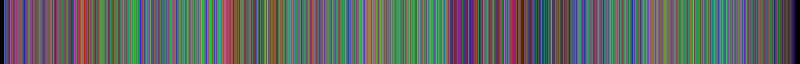
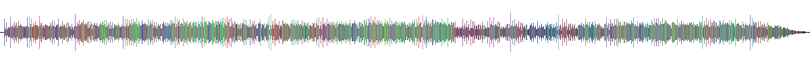
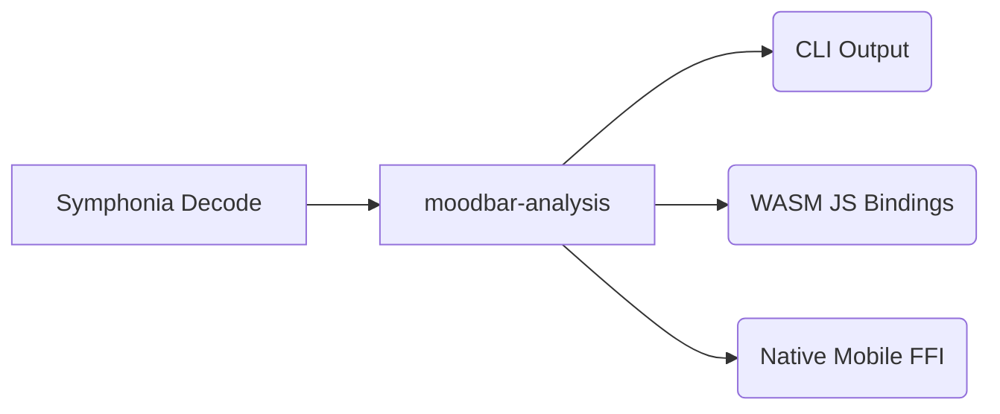

# Moodbar (Rust)

[](https://crates.io/crates/moodbar)
[](https://www.npmjs.com/package/@moodbar/wasm)
[](https://www.npmjs.com/package/@moodbar/native)
[](https://gildesmarais.github.io/moodbar.rs/)

CLI-first moodbar generator in Rust, with WASM and Native (iOS/Android) bindings. All packages are published automatically via GitHub Actions (with trusted publishing).

## What is a Moodbar?

A moodbar is a visual timeline of a song that maps frequencies and intensities to colors.

- The **classic strip** shows you the overall mood and progression of the track visually.
- The **modern waveform** view lets you pinpoint drops and structural changes at a glance before you even listen.

### Classic Strip



### Modern Waveform



## Architecture

This project is built around the "One Rust Core" philosophy. We do the heavy DSP lifting once, and expose it via bindings to the platforms you actually use.



## Prerequisites

- Rust toolchain (stable)
- `make`
- Node.js (required for `make wasm` / npm package preparation)

## Install

```bash
cargo install --path crates/moodbar-cli
```

## Quick Start

```bash
# generate legacy raw moodbar bytes (.mood)
cargo run -p moodbar -- generate -i input.ogg -o output.mood

# generate SVG output (strip, waveform, or split-band shapes)
cargo run -p moodbar -- generate -i input.ogg -o output.svg --format svg --svg-shape waveform
cargo run -p moodbar -- generate -i input.ogg -o split.svg --format svg --svg-shape split-stacked

# inspect a moodbar file
cargo run -p moodbar -- inspect -i output.mood
```

For installed usage, replace `cargo run -p moodbar --` with `moodbar`.

## Advanced Options

Common tuning flags include `--normalize-mode`, `--deterministic-floor`, `--detection-mode`, `--frames-per-color`, and `--band-edges-hz`.
Use command help for full details:

```bash
moodbar generate --help
moodbar batch --help
```

## Batch Mode

```bash
cargo run -p moodbar -- batch -i ./music -o ./moods --progress
```

## Repository Layout

- `crates/moodbar-analysis`: Source of truth for DSP, FFT, normalization, and rendering (SVG/PNG, including split-band shapes)
- `crates/moodbar-decode`: Symphonia decode → mono PCM → `analyze_pcm_mono`
- `crates/moodbar-bindings-schema`: Serde option patches for WASM/FFI (no DSP)
- `crates/moodbar-core`: Backward-compatible CLI API; rendering delegates to `moodbar-analysis`
- `crates/moodbar-cli`: `generate`, `batch`, `inspect` commands
- `crates/moodbar-wasm`: WASM bindings — pre-decoded PCM only (browser decodes)
- `crates/moodbar-native-ffi`: C ABI for mobile; uses `moodbar-decode` + `moodbar-analysis`
- `packages/moodbar-native`: React Native/Expo module for iOS + Android
- `tests/fixtures/legacy`: optional parity fixtures
- `scripts/`: helper scripts

## Contributing

For advanced maintainer workflows, tests, CI/CD logic, and native build scripts, please see [CONTRIBUTING.md](CONTRIBUTING.md).
